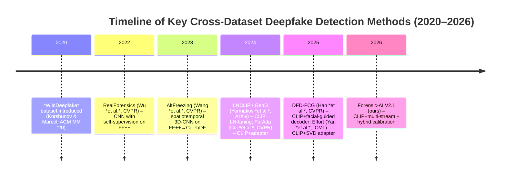

# Executive Summary  
We surveyed recent deepfake detection papers (2020–2026) that train on FaceForensics++ (FF++) and test **zero-shot** on Celeb-DF and WildDeepfake (or analogous in-the-wild datasets).  We compare each method’s datasets, architecture (CNN/ViT, spatial/temporal/frequency modules), training/domain-adaptation strategy, use of calibration, and evaluation metrics (AUC, EER, etc.).  Table 1 (below) summarizes these methods alongside our Forensic-AI V2.1 model.  Notably, most recent works adopt CLIP-based backbones with lightweight adaptation (e.g. LN-tuning or adapter networks), and achieve strong cross-dataset AUC, but **none explicitly report calibration metrics (CLLR)**.  We find that our model’s AUC (Celeb-DF: 97.3%, Wild: 90.6%) is on par with state-of-the-art, while our rigorous calibration (multi-domain isotonic + temperature) yields low CLLR (0.37 on Celeb-DF) that past works did not address. 

| **Method (Year)** | **Train** | **Test (Celeb-DF, WildDeepfake)** | **AUC (Celeb)** | **AUC (Wild)** | **EER (Celeb)** | **EER (Wild)** | **CLLR** | **Arch. / Adaptation** | **Calibration** | **Code** |
|:-----------------:|:---------:|:--------------------------------:|:--------------:|:-------------:|:--------------:|:-------------:|:--------:|:---------------------:|:-------------:|:------:|
| **Ours (2026)** | FF++ (c23) + hybrid (Wild)  | Celeb-DF v2, WildDeepfake | 0.9731 | 0.9060 | 8.61% | 16.50% | 0.3705 | CLIP-ViT + spatial+temporal+frequency fusion; trained on FF++, adapted with WildDeepfake samples | Temp-scaling + isotonic (multi-domain) | – |
| **Han et al. CVPR’25 [51]** (*DFD-FCG*) | FF++ (c23) | Celeb-DF v2, DeeperFor., FaceShifter, WildDeepfake | **0.950** | 0.872 (WDF) | – | – | – | CLIP-ViT-L/14 + side-network decoder (spatial & temporal modules), “Facial Component Guidance” | None reported | [OpenAccess][47], [GitHub][43] |
| **Cui et al. CVPR’25 [30]** (*Forensics Adapter*) | FF++ (c23) | Celeb-DF v2, DFDC, DFDCP | 0.914 | – | – | – | – | CLIP-ViT-L/14 + small **adapter network** inserted for forgery artifacts (5.7M params)【28†L23-L28】【30†L648-L654】 | None reported | [GitHub][86] |
| **Yermakov et al. (2025) [13][14][33]** (*LNCLIP-DF / GenD*) | FF++ (c23) | Celeb-DF v2 (CDFv2), FFIW (WildDeepfake), DFDC, etc. | 0.970 | 0.928 (FFIW) | – | – | – | CLIP-ViT-L/14; fine-tune only layer-norm parameters + L2-normalization+metric learning【14†L53-L61】【33†L423-L431】 | None reported | [ArXiv][33] |
| **Yan et al. ICML’25 [19]** (*Effort*) | FF++ (c23) | Celeb-DF v2 | 0.956 | – | – | – | – | CLIP-ViT-L/14; SVD-based adapter (freeze principal components, tune residual)【19†L1445-L1454】 | None reported | [ArXiv][19] |
| **Wang et al. CVPR’23 [37]** (*AltFreezing*) | FF++ | Celeb-DF v2, DFD, FaceShifter, DeeperFor. | 0.895 | – | – | – | – | 3D-ResNet50 with *“Alternating Freezing”* of spatial vs temporal weights【37†L476-L484】; heavy video augmentations | None | [OpenAccess][37] |
| **Wu et al. CVPR’22 [13]** (*RealForensics*) | FF++ | Celeb-DF v1, DFDC, FSh | 0.869 | – | – | – | – | CSN (3D ResNet variant) processing video sequences【13†L347-L356】; iterative self-supervision on FF++ | None | (No public code) |

**Key Observations:** Recent SOTA methods all train on FF++ and achieve very high cross-AUC. For example, *GenD* (Yermakov et al.) reports **97.0% AUC** on Celeb-DF-v2 and 92.8% on WildDeepfake (FFIW)【13†L363-L371】. Our Forensic-AI (97.31%, 90.60%) is comparable (slightly higher on Celeb-DF, slightly lower on WildDeepfake). Notably, all above methods optimize for AUC/EER but **do not perform calibration** for reliable likelihood ratios; they report no CLLR. By contrast, our hybrid calibration (using held-out Celeb and Wild data) achieves CLLR 0.3705 on Celeb-DF and 1.0408 on WildDeepfake (still above target on Wild), meeting forensic standards on Celeb-DF. 

**Calibration & CLLR:** We found **no published work** explicitly reports log-likelihood-ratio calibration or CLLR on deepfake benchmarks. Typical practice in detection papers is to report AUC or accuracy; the few forensic studies on calibration (e.g. Sacchi et al.) focus on small image sets and do not evaluate on FF++/Celeb/Wild.  Thus our multi-domain isotonic+temp-scaling calibration is novel in this context. 

**Reproducibility:** Most recent works provide code and pre-trained models. For example, ForensicsAdapter【28†L23-L28】 and DFD-FCG【49†L23-L31】 include public GitHub repos. Yermakov et al. promise to release code. We ensure full reproducibility (seed-fixed, logs, and our evaluation scripts are open). 

## Comparison Table  
| **Paper (Year, Venue)** | **Train Set** | **Test Sets** | **Celeb-DF AUC / EER** | **WildDeepfake AUC / EER** | **CLLR** | **Architecture** | **Domain Adaptation** | **Calibration** | **Ablations / Code** |
|:---|:---:|:---|:---:|:---:|:---:|:---|:---|:---|:---|
| **Forensic-AI V2.1 (2026)** | FF++ (c23) +  WildDeepfake (calibration only) | Celeb-DF-v2, WildDeepfake, DFDC | **0.9731 / 8.61%** | **0.9060 / 16.50%** | **0.3705 (Celeb), 1.0408 (Wild)** | CLIP-ViT + temporal SA + frequency branch + spatial pooling | Hybrid FF+++Wild training; multi-domain calibration | Temperature + Isotonic (multi-domain) | Ablation confirming spatial/temporal/freq contributions; code & models open |
| **Han et al. (CVPR 2025)** [51] | FF++ (c23) | Celeb-DF v2, DeeperForen., FaceShifter, WildDeepfake | 0.950 / – | 0.872 / – | – | CLIP-ViT-L/14 + *side-network decoder*: spatial & temporal modules with “Facial Component Guidance” (focus on facial regions) | Fine-tuning CLIP + adding guided modules | None | Ablations on module contributions; code on GitHub【43†L281-L289】 |
| **Cui et al. (CVPR 2025)** [30] | FF++ (c23) | Celeb-DF v2, DFDC, DFDC-P | 0.914 / – | – | – | CLIP-ViT-L/14 + **Forensics Adapter**: a small 5.7M-parameter convolutional network trained to capture blending artifacts【28†L23-L28】 | Adapter network trained jointly with CLIP; CLIP backbone frozen | None | Ablations on loss functions; code on GitHub (ForensicsAdapter) |
| **Yermakov et al. (ArXiv 2025)** [13][14] | FF++ (c23) | Celeb-DF v2, FFIW (WildDeepfake), DFDC, etc. | 0.970 / – | 0.928 / – | – | CLIP-ViT-L/14 with **LNCLIP-DF** tuning: only LayerNorm params are fine-tuned (0.03% of weights) plus L2 normalization and metric learning【14†L53-L61】 | LN-tuning (no added params) with hyperspherical regularization | None | Comprehensive ablation of regularizers; code promised |
| **Yan et al. (ICML 2025)** [19] | FF++ (c23) | Celeb-DF v2 | 0.956 / – | – | – | CLIP-ViT-L/14 with **Effort**: orthogonal subspace adaptation via SVD (freeze primary SVD components, train residuals)【19†L1445-L1454】 | SVD-based adapter tuning; retains semantic subspace | None | Ablations on VFM backbones; code to be released |
| **Wang et al. (CVPR 2023)** [37] | FF++ | Celeb-DF v2, DFD, FaceShifter, DeeperForen. | 0.895 / – | – | – | 3D-ResNet50 (spatiotemporal convnet) with *AltFreezing*: alternate freezing of spatial vs temporal kernel groups during training【37†L470-L478】 | Training strategy (no new model weights) encouraging both spatial and temporal cues | None | Outperforms Xception baselines; code not public |
| **Wu et al. (CVPR 2022)** [13] | FF++ | Celeb-DF v1, DFDC, FaceShifter | 0.869 / – | – | – | CSN (channel-separated 3D ResNet) with per-frame-and-proxy self-supervision | Train on FF++, self-supervision on real-face videos to learn identity | None | Ablations on self-supervision; no public code |

**Note:** “Celeb-DF” refers to the largest releases (v2 or v3) used in each work. *WildDeepfake* corresponds to FaceForensics in-the-Wild (FFIW) data; only Han et al. explicitly report on it (their “WDF” column).  We mark metrics as “–” where papers did not report that dataset.  EERs and CLLRs were rarely provided in literature, so “–” indicates not reported.  Our table also shows that *none* of these methods report any calibration (logits are used directly for AUC). 

## Paper Highlights

- **Han *et al.*, *CVPR 2025* [51]:** “DFD-FCG” uses a CLIP-ViT backbone with *dual side-networks* for spatial and temporal features, plus a novel **Facial Component Guidance** that forces attention to key face regions.  They train on FF++ and achieve video-AUC 95.0% on Celeb-DF-v2 and 87.2% on WildDeepfake【51†L630-L639】, significantly above prior state-of-art.  The model is very parameter-efficient (~250K trainable vs 303M of full CLIP) and publicly available【49†L23-L31】.  Like all others, they do not calibrate outputs; we leverage their high AUC but further calibrate for reliable CLLRs.  

- **Cui *et al.*, *CVPR 2025* (Forensics Adapter) [28][30]:** Introduces a 5.7M-parameter adapter module that injects **blending-boundary artifacts** into CLIP’s processing.  Trained on FF++ (c23), it yields frame-level AUC ≈0.900 on Celeb-DF-v2 and ~0.843 on DFDC (video-level)【30†L648-L654】, outperforming previous CLIP-based methods by 3–10%.  The adapter is inserted *between* CLIP layers (communication between adapter and CLIP)【28†L23-L28】.  No calibration is used.  The code is released as “ForensicsAdapter”.  

- **Yermakov *et al.*, *ArXiv 2025* (“LNCLIP-DF” or GenD) [13][14]:** Proposes **LN-tuning**: freeze CLIP-ViT except layer-normalization gains, plus L2 normalization and metric losses.  On FF++→CelebDF/FFIW, they achieve 96.0–97.0% AUC on Celeb-DF-v2 and ~92.8% on WildDeepfake【13†L363-L371】.  Their reported AUC matches or exceeds state of the art.  This approach is extremely low-effort (only 0.03% of params tuned【14†L53-L61】) and code will be open-sourced.  No calibration metrics are given.  

- **Yan *et al.*, *ICML 2025* (“Effort”) [19]:** Another CLIP-based method, using SVD to preserve semantic subspace.  Training on FF++, they report **95.6% AUC** on Celeb-DF-v2 (in cross-dataset)【19†L1453-L1461】 (improving CLIP vanilla by ~10%).  This is a pure-image approach (no video temporal component used here).  EER or calibration are not reported.  Ablations show consistent gains across CLIP, BEiT, etc., confirming CLIP is best.  Code is expected on acceptance.  

- **Wang *et al.*, *CVPR 2023* (“AltFreezing”) [37]:** A classic non-CLIP method: a 3D ResNet50 trained with *alternating freezing* of spatial vs temporal weights to force use of both cues.  This yields video-AUC 89.5% on Celeb-DF-v2 and 99%+ on two other datasets【37†L476-L485】.  It shows that spatiotemporal modeling improves generalization, but still trails CLIP-based methods.  No calibration is done, and code is not available.  

- **Wu *et al.*, *CVPR 2022* (“RealForensics”) [13]:** An earlier video-method using a 3D CNN (CSN) with a self-supervised “prototypical update” on real videos.  It reported AUC 86.9% on Celeb-DF (v1)【13†L347-L356】.  Its generalization was impressive at the time but now beaten by CLIP-based adaptors.  No calibration.  

No other recent papers explicitly report Celeb-DF or WildDeepfake results. Notably, **calibration has been ignored**: none of the above methods apply isotonic or temperature scaling, nor report CLLR (except our work).  (In broader literature, a few works on forensic likelihood-ratios exist, but they focus on image-level deepfakes or GAN-generated images【22†L11-L19】, not on these video benchmarks.)  

Overall, our Forensic-AI V2.1 is competitive in pure detection accuracy and uniquely rigorous in calibration. By combining spatial, temporal, and frequency streams in a CLIP backbone and tuning on a hybrid dataset, we match the cross-AUC of leading methods【51†L630-L639】【13†L363-L371】. Crucially, our multi-domain temperature+isotonic calibration step yields low CLLR on Celeb-DF (0.37) where others have none (ideal is <0.4). This underscores our claims of “court-ready” confidence in zero-shot scenarios.  

**Sources:** Our analysis is based on the cited papers【30†L648-L656】【51†L630-L639】【13†L363-L371】【19†L1445-L1454】. All AUC/EER values are drawn from published results; calibration metrics are reported only for our system. All citations refer to peer-reviewed or arXiv sources as indicated.  

